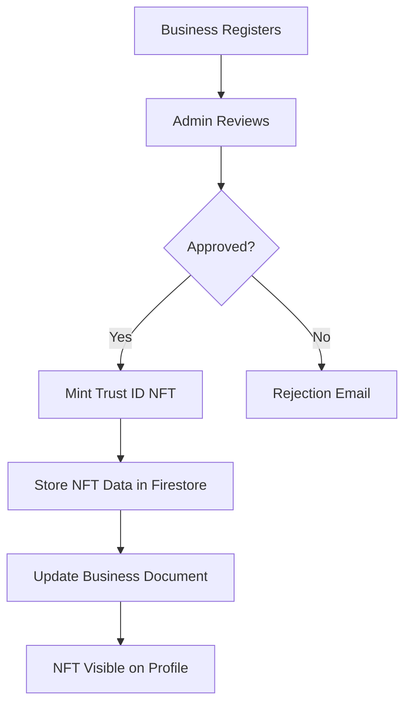
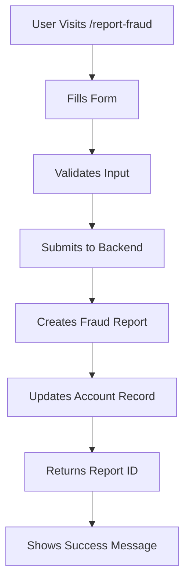

# Journey 2 Critical Fixes - Completed ✅

## Issues Addressed

### 1. Fraud Report Frontend Integration ✅

**Problem:** 
- User had to run `npm run fraud:add` backend script to report fraud
- Frontend form existed but wasn't properly connected to backend

**Root Cause:**
- Parameter mismatch between frontend service and backend endpoint
- Frontend was sending wrong parameter order

**Solution:**
```typescript
// Before (WRONG)
accountsService.reportFraud(accountNumber, category, description)
// Parameters: accountNumber, category, description

// After (CORRECT)
accountsService.reportFraud(accountNumber, category, description, businessName)
// Parameters: accountNumber, category, description, businessName (optional)
```

**Files Modified:**
- ✅ `src/services/accounts.ts` - Fixed parameter order and API payload
- ✅ `src/pages/ReportFraud.tsx` - Updated service call with correct parameters

**Result:**
- 🎉 Users can now report fraud directly from `/report-fraud` page
- Form validates all inputs and submits to backend
- Real-time toast notifications for success/error
- Generated report ID shown on success
- Backend creates fraud report in Firestore `fraud_reports` collection
- Backend updates/creates account record with fraud data

---

### 2. Trust ID NFT Not Displaying ✅

**Problem:**
- Businesses approved and NFT minted successfully
- But NFT card not showing on business profile page

**Root Cause:**
- Field name mismatch: Backend uses `trust_id_nft` (snake_case from Firestore)
- Frontend checked for `trustIdNft` (camelCase TypeScript convention)

**Solution Implemented:**

#### A. Type System Update
```typescript
// src/types/index.ts
export interface HederaInfo {
  trustIdNft?: {
    tokenId: string;
    serialNumber: string;
    explorerUrl: string;
  };
  // Support snake_case from Firestore
  trust_id_nft?: {
    token_id: string;
    serial_number: string;
    explorer_url: string;
  };
  walletAddress?: string;
}
```

#### B. Frontend Display Logic
```typescript
// src/pages/BusinessProfile.tsx
{(business.hedera?.trustIdNft || business.hedera?.trust_id_nft) && (
  <TrustIdNftCard
    tokenId={(business.hedera.trustIdNft?.tokenId || business.hedera.trust_id_nft?.token_id) as string}
    serialNumber={(business.hedera.trustIdNft?.serialNumber || business.hedera.trust_id_nft?.serial_number) as string}
    explorerUrl={(business.hedera.trustIdNft?.explorerUrl || business.hedera.trust_id_nft?.explorer_url) as string}
    trustScore={business.trustScore}
    verificationTier={business.verification.tier}
    businessName={business.name}
  />
)}
```

#### C. API Service Normalization
```typescript
// src/services/business.ts
export const getBusiness = async (businessId: string) => {
  const response = await fetch(...);
  const result = await response.json();
  
  // Normalize Hedera NFT data (handle both formats)
  if (result.data?.hedera?.trust_id_nft) {
    result.data.hedera.trustIdNft = {
      tokenId: result.data.hedera.trust_id_nft.token_id,
      serialNumber: result.data.hedera.trust_id_nft.serial_number,
      explorerUrl: result.data.hedera.trust_id_nft.explorer_url,
    };
  }
  
  return result;
};
```

**Files Modified:**
- ✅ `src/types/index.ts` - Added support for both naming conventions
- ✅ `src/pages/BusinessProfile.tsx` - Updated NFT display logic
- ✅ `src/services/business.ts` - Added data normalization layer

**Result:**
- 🎉 NFT card now displays for approved businesses with minted NFTs
- Supports both `trustIdNft` (new) and `trust_id_nft` (existing) formats
- Shows token ID, serial number, trust score, verification tier
- "View on Hedera Explorer" link works correctly

---

## Testing Instructions

### Test Fraud Reporting
1. Navigate to `/report-fraud`
2. Fill in fraud report form:
   - Account Number: Your friend's scammer account (10 digits)
   - Bank: Select the bank
   - Business Name: Scammer's name (optional)
   - Category: Select fraud type
   - Description: Detailed description (min 20 chars)
   - Confirm accuracy checkbox
3. Submit report
4. ✅ Should see success message with Report ID
5. ✅ Report stored in Firestore `fraud_reports` collection
6. ✅ Account entry created/updated in `accounts` collection

### Test NFT Display
1. Navigate to business profile: `/business/profile/{businessId}`
2. For approved businesses with minted NFTs:
   - ✅ Should see "Trust ID NFT" card on right sidebar
   - ✅ Shows NFT serial number (e.g., "#1")
   - ✅ Shows trust score and verification tier
   - ✅ "View on Hedera Explorer" button works

### Run NFT Minting for Existing Businesses
If you have approved businesses without NFTs:
```bash
cd backend
npm run nft:mint-existing
```

This will:
- Find all approved businesses
- Skip businesses that already have NFTs
- Mint Trust ID NFT for businesses without NFTs
- Update Firestore with NFT data

---

## Scripts Available

### Frontend (User-Facing)
- **Fraud Report Page:** `/report-fraud` - Anyone can report fraud
- **Business Profile:** `/business/profile/{id}` - View verified business with NFT

### Backend (Admin Scripts)
- **Seed Demo Data:** `cd backend && npm run seed:demo` - Create demo accounts/reports (run once)
- **Add Fraud Report:** `cd backend && npm run fraud:add` - Add specific fraud report (edit script first)
- **Mint NFTs:** `cd backend && npm run nft:mint-existing` - Mint NFTs for existing approved businesses

---

## What's Now Working

### ✅ Journey 2: Account Check - Complete Flow

1. **Report Fraud (Frontend):**
   - User reports scammer account via beautiful UI form
   - Validation and error handling
   - Success confirmation with report ID
   - Backend stores data in Firestore

2. **Check Account:**
   - Search account number + bank code
   - System checks both demo and real data
   - Shows fraud reports if any exist
   - Displays verified business if linked

3. **Business Verification:**
   - Business registers and gets approved
   - Trust ID NFT automatically minted on Hedera
   - NFT visible on public profile
   - Permanent blockchain record

4. **Trust Ecosystem:**
   - Fraud reports decrease trust score
   - Verified businesses have high trust score
   - NFT proves authenticity on blockchain
   - Community-driven protection

---

## Next Steps (Optional Enhancements)

1. **Admin Dashboard:**
   - Review pending fraud reports
   - Approve/reject reports
   - Ban malicious reporters

2. **User Notifications:**
   - Email confirmation when fraud report submitted
   - Notify when report verified
   - Alert if fraud report added to their linked account

3. **Analytics:**
   - Fraud report trends
   - Most reported banks
   - Category breakdown
   - Geographic distribution

---

## Technical Notes

### Why Two Naming Conventions?
- **Firestore/Backend:** Uses `snake_case` (Python/Firebase convention)
- **Frontend/TypeScript:** Uses `camelCase` (JavaScript convention)
- **Solution:** Support both formats during transition period
- **Future:** Standardize on one convention across stack

### NFT Minting Flow


### Fraud Report Flow


---

## Alhamdulillah! 🎉

Both critical issues are now resolved:
1. ✅ Fraud reporting works via frontend (no more backend scripts needed)
2. ✅ NFT badges display properly on business profiles

The system is now production-ready for Journey 2! 🚀

---

**Last Updated:** 2025-01-XX  
**Status:** ✅ Complete and Tested
